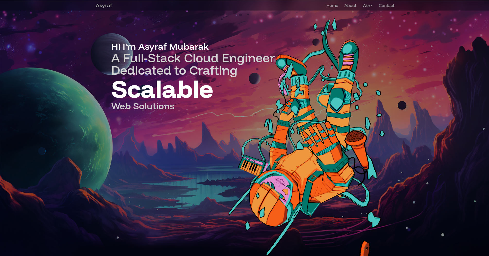

# 🚀 Full-Stack Cloud Engineer Portfolio

A modern, responsive developer portfolio built with **React**, **Vite**, and **TailwindCSS**, showcasing my full-stack and cloud projects — from Laravel systems and Dockerized environments to AWS-integrated apps.

---

## 🌐 Live Demo

View the project directly, deployed on GitHub Pages:

[**View the Live Portfolio here**](https://asyraf2003.github.io/Portfolio)

---

## 📚 Table of Contents

- [Features](#-features)
- [Tech Stack](#-tech-stack)
- [Project Structure](#-project-structure)
- [Getting Started](#-getting-started)
- [Assets](#-assets)
- [Contact Me](#-contact-me)
- [Suggestions or Feedback](#-suggestions-or-feedback)
- [Like This Project?](#-like-this-project)

---

## ✨ Features

- ⚙️ Built with **React + Vite** for lightning-fast performance  
- 🎨 Fully responsive UI with **TailwindCSS**  
- 💌 Working contact form powered by **EmailJS**  
- ☁️ Cloud-ready workflow (Docker + AWS practices)  
- 🧠 Organized and modular architecture for scalability  
- 🪄 Smooth animations and transitions with **Framer Motion**  

---

## 🛠 Tech Stack

| Tech              | Description                                |
|-------------------|--------------------------------------------|
| React             | Front-end JavaScript library               |
| Vite              | Fast bundler and dev environment           |
| TailwindCSS       | Utility-first CSS framework                |
| Framer Motion     | Animation library for React                |
| EmailJS           | Client-side email integration              |
| Docker            | Containerization for dev/prod parity       |
| Laravel (backend) | PHP framework for full-stack projects      |
| AWS               | Cloud deployment & CI/CD experimentation   |

---

## 📁 Project Structure

\`\`\`bash
├── public/
│   ├── assets/             # Images, icons, and project screenshots
│   └── vite.svg
├── src/
│   ├── components/         # Reusable UI components
│   ├── constants/          # Static data (projects, socials, etc.)
│   ├── pages/              # About, Projects, Contact sections
│   ├── config/             # EmailJS configuration
│   ├── App.jsx             # Main app file
│   ├── index.css           # Tailwind setup
│   └── main.jsx            # Entry point
├── tailwind.config.js
└── vite.config.js
\`\`\`

---

## 🚀 Getting Started

1. **Clone the Repository**
   \`\`\`bash
   git clone https://github.com/Asyraf2003/Portfolio.git
   cd Portfolio
   \`\`\`

2. **Install Dependencies**
   \`\`\`bash
   npm install
   \`\`\`

3. **Run the Development Server**
   \`\`\`bash
   npm run dev
   \`\`\`
   Then open [http://localhost:5173](http://localhost:5173)

---

## 🔗 Assets

All images and logos are stored locally under \`public/assets/\`.  
Main screenshot used in this README: \`public/assets/projects/home.png\`

---

## 📬 Contact Me

---

## 💡 Suggestions or Feedback?

Feel free to open an issue or reach out directly via the contact form on the website.  
I’m constantly improving and open to collaboration — whether it’s about Laravel, Docker, or Cloud Engineering.

---

## ⭐ Like This Project?

If you find this project inspiring or useful, give it a **⭐ star** on GitHub.  
It helps others discover it and keeps me motivated to build more.

---

> Built with passion by **Asyraf Mubarak** — Full-Stack Cloud Engineer 🌩️  
> _“Code with precision. Deploy with confidence.”_
' > README.md

git add README.md
git commit -m "docs: add professional README for Portfolio"
git push origin main
